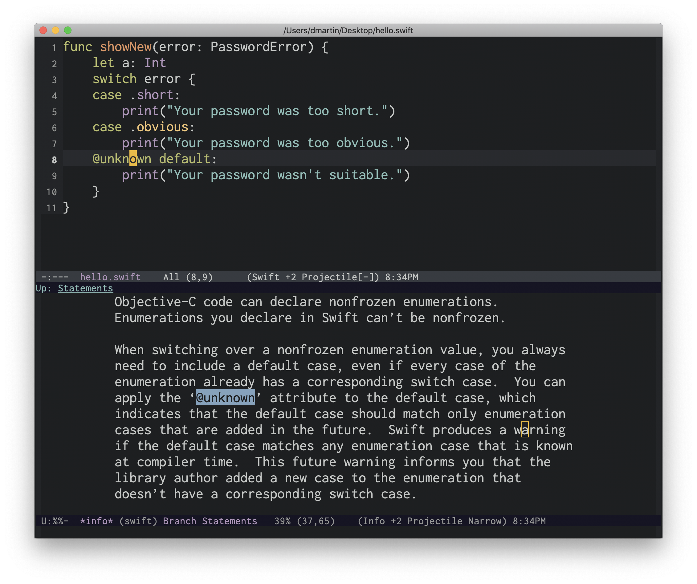

# swift-info



(Work in progress.)

Curated Swift 5.1 documentation and reference in GNU Info format, with cross-references and indices for concepts and keywords.

You can export the documentation yourself from the `swift.org` file by using the [Org to Texinfo exporter](https://orgmode.org/manual/Texinfo-export.html).

You can also generate the Info manual from the `.texi` file if you have the `makeinfo` program installed.

```sh
makeinfo --no-split swift.texi
```

If you use macOS, I recommend you install a newer version of GNU texinfo:

```sh
brew install texinfo
```

## Emacs

If you use Emacs, you can add this Info manual to the list of existing manuals:

```elisp
(add-to-list 'Info-directory-list "<Path to swift-info repository>")
```

If you want to use `info-lookup-symbol` in `swift-mode`, add the following code to your configuration file:

```elisp
(require 'info-look)
(info-lookup-maybe-add-help
 :mode 'swift-mode
 :regexp "[#@_a-zA-Z][_a-zA-Z0-9]*"
 :doc-spec '(("(swift)Index" nil "['`‘]" "['’]")
             ("(swift-reference)Index" nil "['`‘]" "['’]")))
```

Visit a Swift file in `swift-mode`, place the point on a keyword and hit `C-h S` to see definitive discussion about that Swift keyword or concept.

For now, the list of index entries is still very small.
