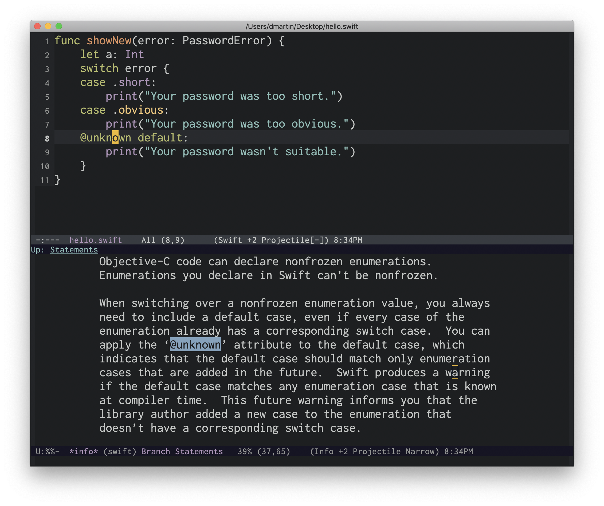

# swift-info



(Work in progress.)

Curated Swift 5.1 documentation and reference in GNU Info format, with cross-references and indices for concepts and keywords.

If you use macOS, I recommend you install a newer version of GNU texinfo:

```sh
brew install texinfo
```

You can export the documentation by making the `all` target:

```sh
make all
```

This will generate up to date `.info` and `.texi` files from `swift.org` and `swift-reference.org`.

You can also export the documentation to HTML (the CSS used is the same one used by the Emacs manuals):

```sh
make html
```

## Emacs

Note that if you are using `swift-info` as part of the `swift-helpful` Emacs package you don't need to follow these instructions because everything is
configured automatically as part of the package installation and load.

You can add this Info manual to the list of existing manuals:

```elisp
(add-to-list 'Info-directory-list "<Path to swift-info repository>")
```

If you want to use `info-lookup-symbol` in `swift-mode`, add the following code to your configuration file:

```elisp
(require 'info-look)
(info-lookup-maybe-add-help
 :mode 'swift-mode
 :regexp "[#@_a-zA-Z][_a-zA-Z0-9\\?!]*"
 :doc-spec '(("(swift)Index" nil "['`‘]" "['’]")
             ("(swift-reference)Index" nil "['`‘]" "['’]")))
```

Visit a Swift file in `swift-mode`, place the point on a keyword and hit `C-h S` to see definitive discussion about that Swift keyword or concept.
